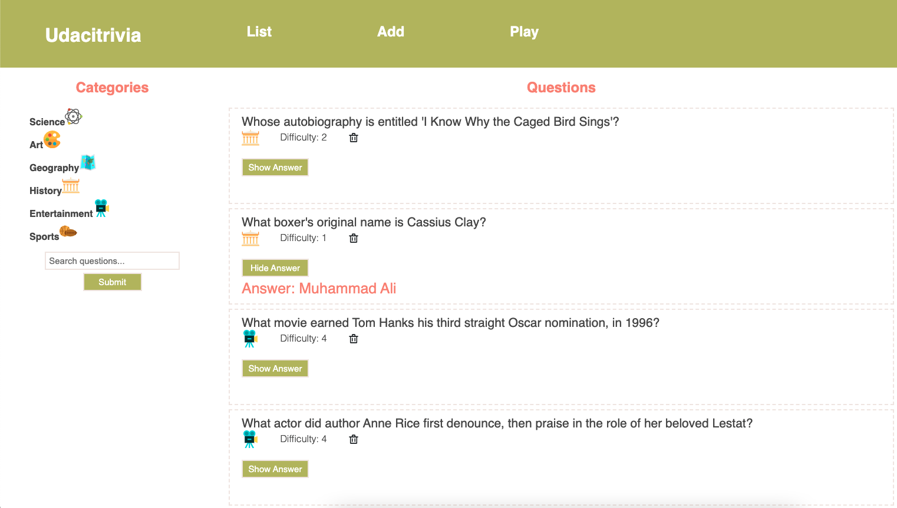
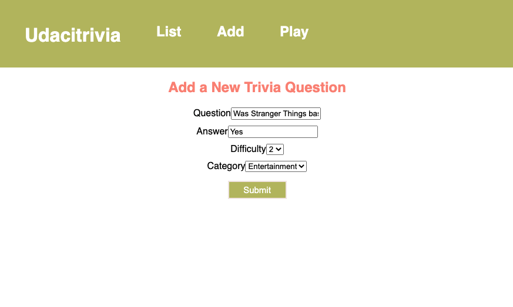
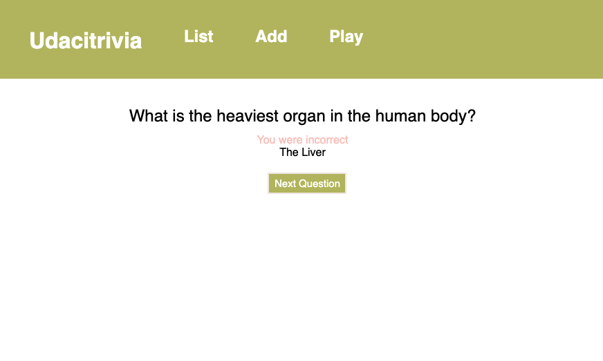

# Trivia Game API
A trivia game with the intent to create bonding experiences. The application is composed of a react-based frontend and flask-based backend. The application performs the following:

1. Display questions - both all questions and by category. Questions should show the question, category and difficulty rating by default and can show/hide the answer.
2. Delete questions.
3. Add questions and require that they include question and answer text.
4. Search for questions based on a text query string.
5. Play the quiz game, randomizing either all questions or within a specific category.

## Screenshots
 

 

## About the Stack
### Backend Dependencies
1. **Python 3.7**
2. **PIP and Virtual Env**
3. **PIP Dependencies** - navigate to `/backend` directory and run: ```pip install -r requirements.txt``` via terminal. 
4. **Key Dependencies**
 - [Flask](http://flask.pocoo.org/) is a lightweight backend microservices framework. Flask is required to handle requests and responses.

 - [SQLAlchemy](https://www.sqlalchemy.org/) is the Python SQL toolkit and ORM we'll use handle the lightweight sqlite database. 

 - [Flask-CORS](https://flask-cors.readthedocs.io/en/latest/#) is the extension we'll use to handle cross origin requests from our frontend server.
5. **Database Setup** - With Postgres running, restore a database using the trivia.psql file provided. 
``` bash
dropdb trivia
createdb trivia
psql trivia < trivia.psql 
```
6. **Running the Server** - From within the `./src` directory, ensure you are working using your created virtual environment. To run the server, execute:
```bash
export FLASK_APP=flaskr
flask run --reload
```

The `--reload` flag will detect file changes and restart the server automatically.

### Frontend Dependencies
The ./frontend directory contains a complete React frontend to display our data from the Flask server. 

1. Install Node and NPM from [https://nodejs.com/en/download](https://nodejs.org/en/download/).
2. Navigate to `/frontend` directory and run ```npm install``` via terminal.
3. Confirm successful install by running ```node -v``` via terminal.
4. Run the application in development mode using ```npm start```
5. Open [http://localhost:3000](http://localhost:3000) to view it in the browser. The page will reload if you make edits.

## Unit Testing
1. Navigate to `/backend/test_flaskr.py`
2. Change `database_name` and `database_path` accordingly. 
3. Run the following commands:
```bash
dropdb trivia_test
createdb trivia_test
psql trivia_test < trivia.psql
python test_flaskr.py
```
## API Reference
### Getting Started
- **Base URL:** http://127.0.0.1:5000/ <br>  
>_NOTE_: Application is meant to run locally.
- **API Keys:** Not applicable. 
- **Authentication:** Not applicable.

### Error Handling
#### Response Codes
- **404** - resource not found
- **422** - unprocessable
- **400** - bad request

#### Error Messages
Error messages are returned as JSON objects. See the following example:
```bash
{
  "error": 404, 
  "message": "resource not found", 
  "success": false
}
```
